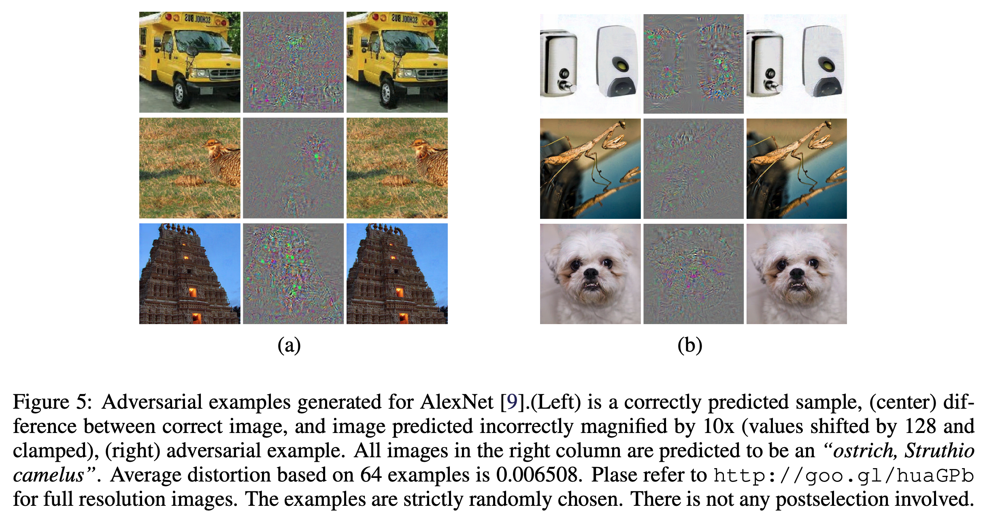
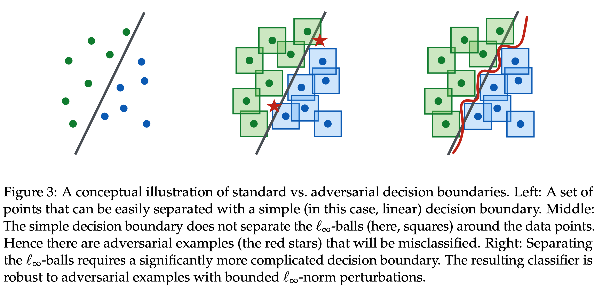
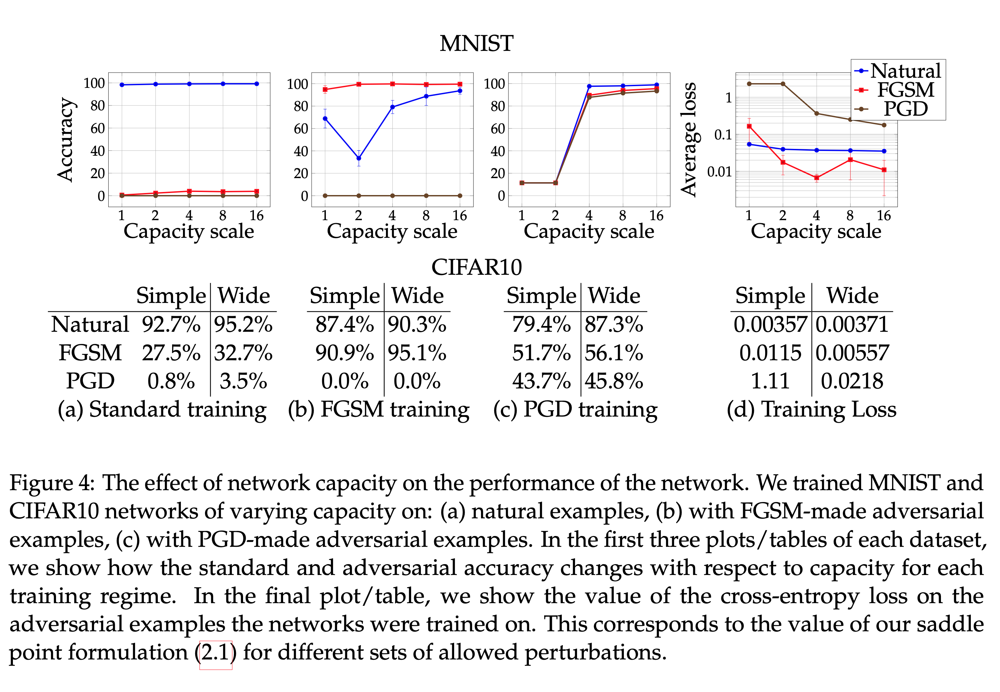
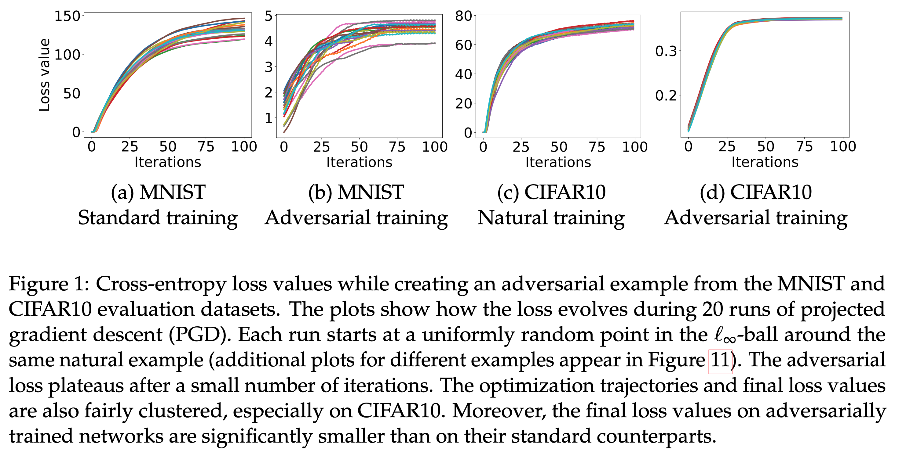
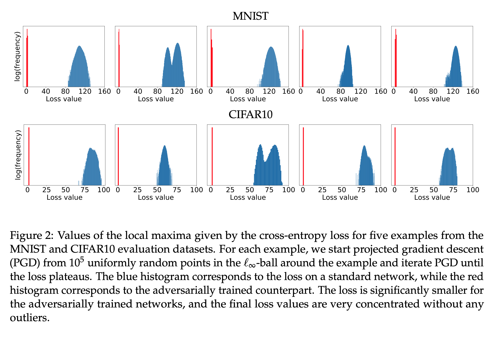
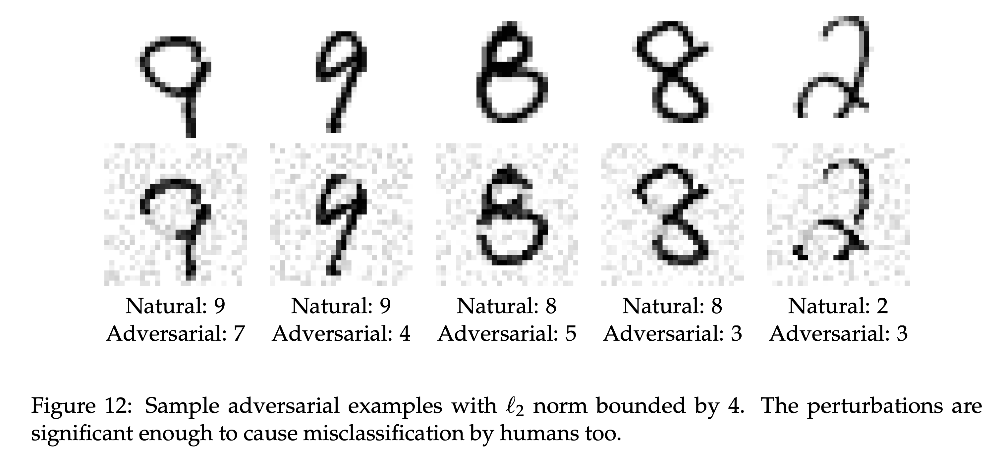

# 深層学習セミナー20200417

MADRY, Aleksander, et al. Towards deep learning models resistant to adversarial attacks. *arXiv preprint arXiv:1706.06083*, 2017.(引用数1482)

## どういうもの

+ NNに対する敵対的攻撃の新手法の開発とその攻撃手法を用いた防御策の提案.

### 敵対的摂動(Adversarial Perbutations)と敵対的データ(Adversarial Examples )

(*1)より

高い正解率(Acuuracy)を出す学習済みNNに対して、例えば画像では人間の目では何も変化していないような画像を入力したときに、出力クラスを間違えてしまうような事象が確認されている.

​    

NNに対する攻撃手法とそれに対する防御策の図.

## 先行研究と並べて何がすごい？

### これまでの攻撃手法と防御策

+ 既存の攻撃手法は１階の勾配を用いてone stepでAdversarial Examplesを探索.

+ 見つけたAdversarial Examplesを学習データに加えて再学習を行う.

  例えば損失関数$L(x,y)$を
  $$
  \alpha \in (0,1)\\
  \alpha L(x^{\rm{nat}},y)+(1-\alpha)L(x^{adv},y)
  $$
  として学習する.

### 本論文での攻撃手法と防御策

+ １階の勾配を用いてmulti stepでAdversarial Examplesを探索.

​        ->より強力なAdversarial Examplesを求めることができる.

+ 見つけたAdversarial Examplesのみで学習を行う。

## 技法や手法の肝

$\theta$をNeral Network(NN)のパラメータ,$(x,y)$をデータ,$L$を損失関数とする.NNの学習では
$$
\min_{\theta} L(\theta,x,y)
$$
の最小化問題を扱う.Adversarial Attackでは$S\subseteq \R^n$として
$$
\max_{\delta\in S} L(\theta,x+\delta,y)
$$
の最大化問題(入力$x$の近傍内という意味でinner maximization)を扱う.

Adversarial Attackに対してNNをロバストにするためには
$$
\min_{\theta}\max_{\delta\in S}L(\theta,x+\delta,y)
$$
の最大値最小化問題を扱う.

以上によりAdversarial Attackでは$L(\theta,x+\delta,y)$をより大きくする$\delta\in S$を探索するアルゴリズムが開発されている.既存のFast Gradient Sign Method(FGSM)(*2)でのadversarial examples $x^{adv}$の式は
$$
x^{adv}:=x + \epsilon \space \rm{sgn} (\nabla_x L(\theta,x,y))
$$
である.$\rm{sgn}$は符号関数を表す.今回のPGD攻撃では$\epsilon$近傍内での$x^{adv}$を見つけるとき,
$$
x^{t+1}=x^t+\alpha \space\rm{sgn}(\nabla_{x^t}L(\theta,x^t,y))\\
x^1\in B_{\epsilon}(x)
$$
という更新式を用いてadversarial examplesを探索する.PGD攻撃のadversarial exampleは
$$
x^{adv}:= x^N
$$
である.($N$は更新回数).

## 実験とその他

### ２階以上の勾配情報は使わないのか.

> SGDを代表とする勾配降下法では１階の勾配情報を用いているため,Adversarial Attackでは１階の勾配情報を用いれば十分.

### パラメータ数の多いNN（表現能力の高いNN）はロバスト

下段のSimleはパラメータの少ないモデル,Wideはパラメータの多いモデルを表す.この結果から,**パラメータ数の多いNNの方がよりロバスト**になることがわかる.またPGD攻撃を用いたAdversarial Trainingを受けたNNは既存の攻撃モデル(FGSM)に対してもロバストとなることがわかる.したがって**PGD攻撃は強力な手法**である.

### PGD攻撃での更新式

$$
x^{t+1}=x^t+\alpha \space\rm{sgn}(\nabla_{x^t}L(\theta,x^t,y))\\
x^1\in B_{\epsilon}(x)
$$

で更新を行うと数列$\{x^t\}$が収束することが実験的にわかった.

上記の図の色は異なる初期点(20点)を表す.損失関数(Loss Value)はCross Entropy.fig1をみると初期点に関わらず,$\{x^t\}$が収束していることがわかる.またAdversarial trainingを行ったNNの方がより早く収束していることがわかる.

異なる初期点を$10^5$個用意してPGD攻撃の更新式を収束するまで更新した結果の棒グラフである.赤色はAdversarial trainingを受けたNNで青色はStandard trainingを受けたNNである.Adversarial trainingを受けたNNの方がより値を集中させて収束していることがわかる.

### PGD攻撃によるAdversarial Examplesの例

## Reference 

*1:SZEGEDY, Christian, et al. Intriguing properties of neural networks. *arXiv preprint arXiv:1312.6199*, 2013.

*2:TRAMÈR, Florian, et al. The space of transferable adversarial examples. *arXiv preprint arXiv:1704.03453*, 2017.

## 今後読むもの

TASHIRO, Yusuke; SONG, Yang; ERMON, Stefano. Output Diversified Initialization for Adversarial Attacks. *arXiv preprint arXiv:2003.06878*, 2020.https://arxiv.org/pdf/2003.06878.pdf

<!--stackedit_data:
eyJoaXN0b3J5IjpbLTY3NzIyMzM5OCwtMjA1NjgxMDIxM119
-->